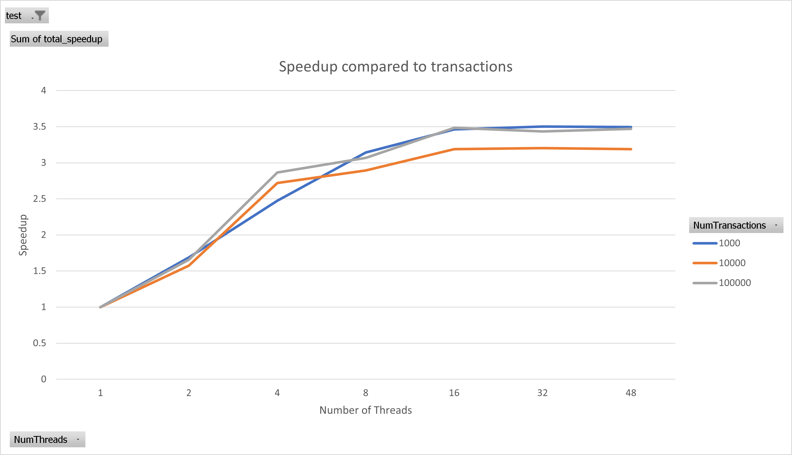
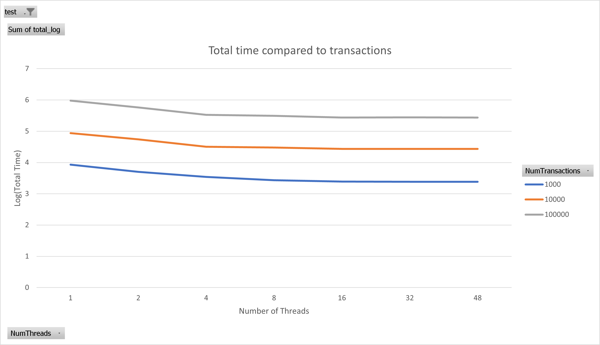
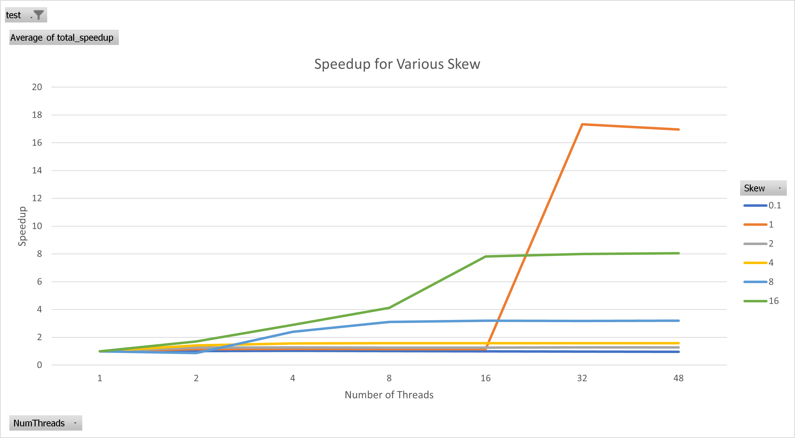
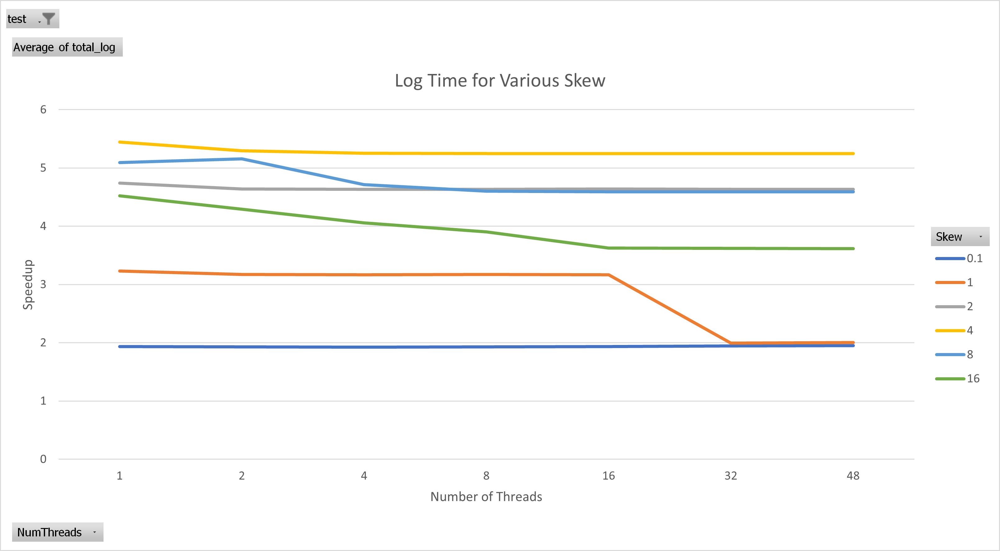
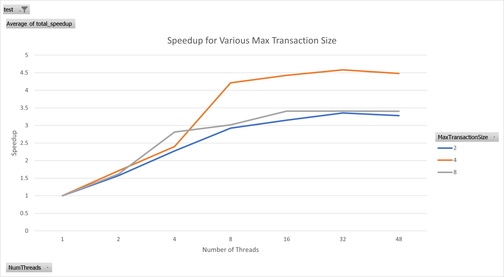
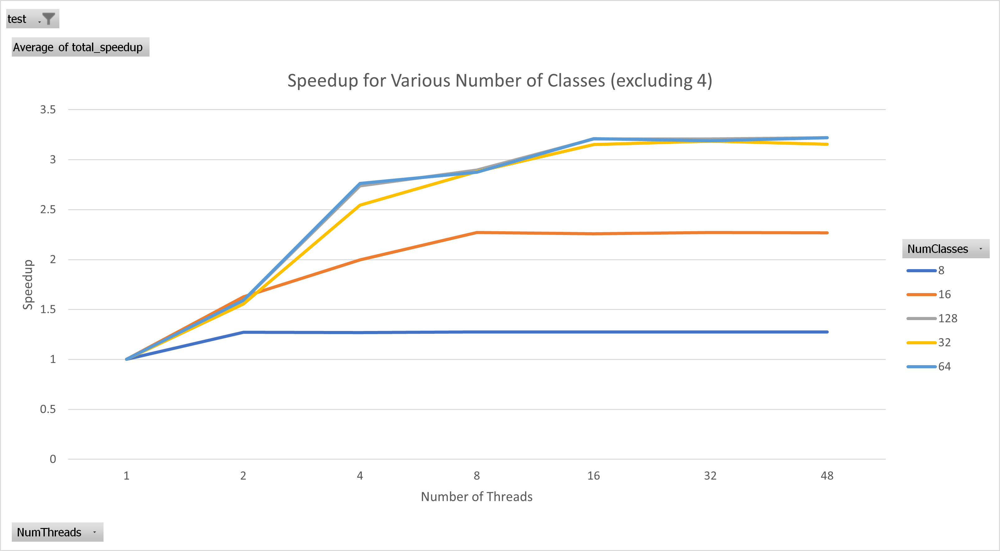
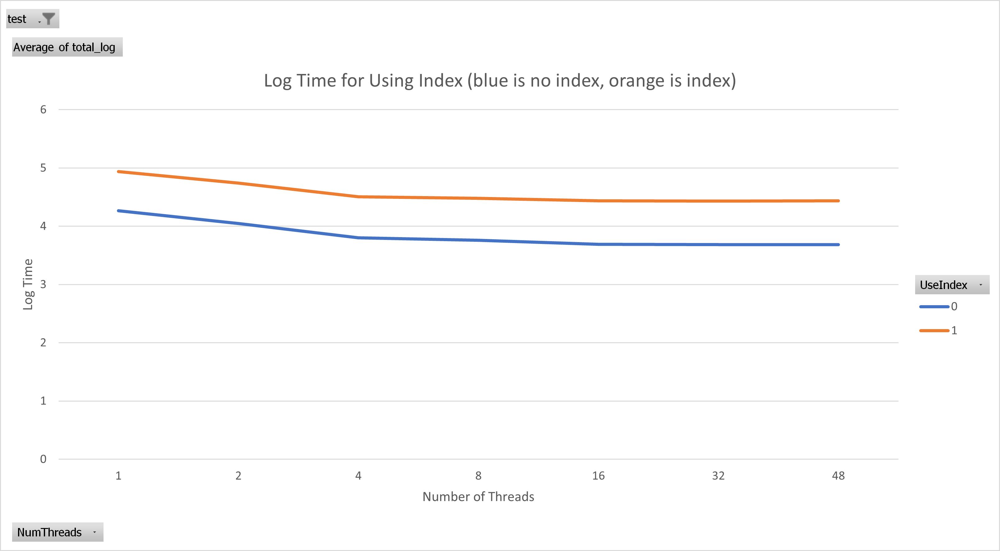
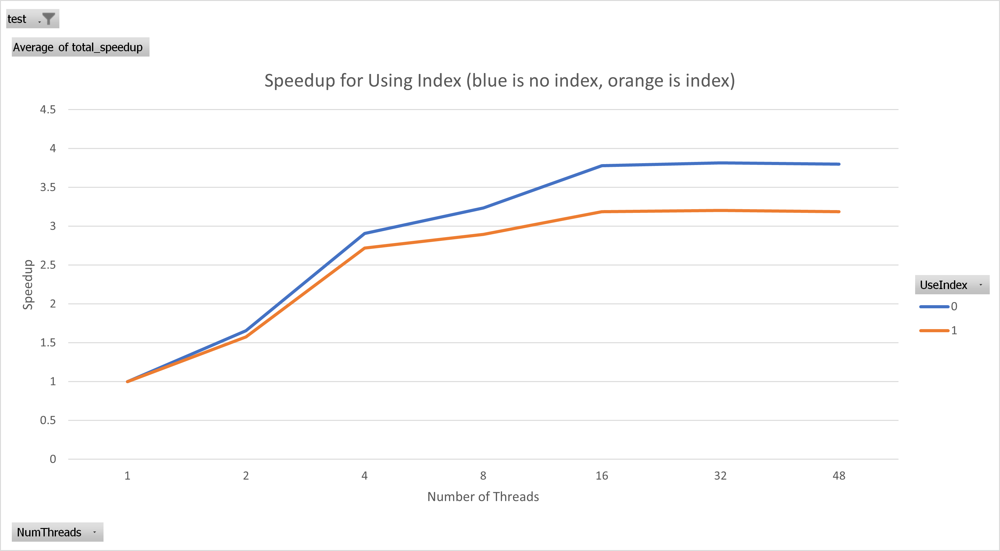

# Association Rule Mining GPU vs CPU Report

PSU CSE 532 Term Project by Scott Richards and Avik Mukherjee

## General Overview of Problem

This course involved solving challenges related to multiprocessors. Specifcally we learned about cache coherence issues and how they can be solved via message passing, busses, and other techniques. This project is designed to explore the limitations of multiprocessor environments for a particular task. We especially were to compare and contrast CPU and GPU applications of the same project.

### Frequency Analysis

The task at hand is that of frequency identification. In other words, if there are various items that can be in a transaction and there are a collection of transactions, identify groupings of items that frequently appear together in transactions. This task is particularly useful for shopping trends when a store owner wishes to identify "complementary goods" - those that are frequently purchased together. This can inform marketing decisions, shelf placement, promotions, and joint deals between companies.

Frequency analysis can be a challenge for various reasons. The data may be sparse resulting in items being purchased on a fraction of transactions. The transactions size might be large, accommodating a myriad of subsets of items. Other considerations might make frequency analysis difficult.

### Systems

For the CPU test, we used the ladon server at Penn State. This machine has four AMD Opteron 6174 processors and 64 MB of memory. Each processor has two Istanbul nodes with 6MB L3 cache while each node has 6 cores with 512KB L2 cache each. In order to minimize snooping between the 4 cores, they utilize a directory system occupying 1MB of each CPU's L3 cache. This reduces memory bandwidth requirements by 60% ([Anandtech](http://it.anandtech.com/show/2774/2)). This being an eleven year old *shared* system, the results at times were unreliable but I ran the tests at off hours and repeated each test three times and took an average result.

For the GPU test, we used a W135 Workstation at PSU which is equipped with an NVidia Quadro K2200 (Maxwell) card.

## Code Description - Shared Code and Dataset Generator

Each transaction is stored as a c++ `bitset` where the indices of active bits represent the items in the transaction. So if there are 4 possible items and a transaction had the value of `1001`, then item `0` and item `3` were included in the transaction. The default `bitset` size, that is, the default transaction size was 128 or 16 bytes. Thus, 10,000 transactions would take up only 160 kB. Using `bitset` enabled certain operations to be completed rather efficiently. For example, identifying the items shared between transactions is a simple bitwise and of the values which (depending on compiler optimizations) can be a single instruction.

The dataset was generated deterministically using a fixed seed in a Mersenne Twister pseudo random number generator. Each transaction is assigned a size (i.e., the number of items in the transaction) randomly between `minTransactionSize` and `maxTransactionSize`. The algorithm will then select a random item having an average of 0 (if the value sampled is negative, the absolute value is used for the item index) and a variance described by `skew`. The following items were sampled with the same skewness as the first, but the mean being the first item (instead of 0).

It is generally efficient to create an index of items and transactions. For example, instead of reviewing all transactions and identifying how many of them contain items A, B, and C, it may be faster to look at a pre-computed index of the transactions associated with A, the transactions of B, and the transactions of C and seeing which transactions are shared between them.

## CPU Approach

The main challenge with the multi-threaded CPU operations is cache consistency. There are 42 cores all using a unified memory model. If one core changes a value in memory, all other cores that have cached that value must be updated or invalidated. When there are few cores, a simple bus is sufficient to do cache bookkeeping. However, with many cores, there needs to be some sort of directory system to ensure messages are kept at a minimum (i.e., a core need not snoop on 41 other cores memory activity). As stated previously, the architecture uses a directory system at the node that eats up a significant portion of L3 cache, but allows a significant amount of inter-core message reduction.

The code has a few main operations. It generally sets the number of concurrent threads to the maximum concurrency of the system (or a lesser amount for testing). As we do not know how the scheduler is operating or whether other processes/users are interfering with the execution of the program, we cannot be sure that each thread will be run on seperate cores.

- `generateDataset` this creates the entire dataset of transactions. It typically takes between 8ms (1k transactions) and 700ms (100k transactions). The linear relationship indicates there are no non-linearities resulting from caching issues.
- `generateCandidates` which generates candidate sets for frequency analysis
  - `identifyActiveItems` identifies which items are still frequent. For example, if the prior round identified that <A,B> and <B,E> were frequent, then A,B, and E would be active. This is a nice property of frequency analysis, if an item is not present in any frequent sets of size 2 then it will not be present in any frequents of size 3 so it can be deemed inactive and excluded from consideration. This operation is almost instantaneous, but is done in parallel just for fun.
  - It will then go through the prior set of frequent items and add various other active items to the set to generate new candidate permutations. This is done in parallel where each thread is responsible for a selection of prior identified frequents and making new permutations from them. This operation takes about 3-20 ms (almost instantaneous).
- `itemsByFrequency` will sort a list of active items by their respective frequency of occurance it does this by:
  - Counting the occurrences of each item in the set of candidates. This operation is done in parallel but only takes about 10-100 ms.
  - Sorting the items based on how often they appear.
- generate equivalence classes by iteratively selecting all of the candidates related to the most frequent item, then the next most frequent item (that do not include previously selected items). This is a useful process as it will ensure that the most frequent item will be analyzed by the same thread which will result in great efficiencies when using the indexing technique. The data for the index for that most frequent item can be cached locally at the core. Equivalence classes are created so that roughly the same amount of work is partitioned to each thread. A more advanced algorithm would enable idle cores to steal work from busy cores, but that might incur a cost for moving cache lines to the idle core.
- `identifyFrequents` This takes the majority of the time as it is where candidate sets are compared with the transaction database to determine if they are frequents. This can be done with two techniques:
  - Using an index. It will look at the index for each of the included items and then do an intersection of their respective transaction lists and see if the count is sufficiently high to be frequent. To help with caching, the index is stored in one long block with helper functions identifying the appropriate regions for an id.
  - Use the transaction database. The system will go through and count how many transactions include all the items using a bitwise mask and comparison to the set.

Most of the operations are "parallelizable". That is to say, the options can be broken up into smaller pieces. Furthermore, mutability can be constrained to items contained within a single thread. See, for example, the `identifyFrequents` function in `frequents.cpp`. It creates jobs for each thread it will spawn. These jobs are given a `const` slice of candidate frequent sets and a `const` reference to the entire transaction database (or index, if specified). Thus, the transaction database and the local candidates are immutable, while a thread builds up a local copy of `frequents`. The main thread will then join all other threads and copy the collection of new `frequents` local to the joined thread into the `allFrequents` vector. This requires a continuous read of a block of cache that is no longer actively being written to. The cores will send almost no data, just the summary information at the end. These communications are very structured as well as there is never a time when one thread is writing to data while another thread is also accessing the data.

In order to test the code, I wrote a python script that varied parameters such as transaction count (`1,000`, `10,000`, `100,000`), number of classes (`4`, `8`, `16`, `32`, `64`, `128`), "skew" (`0.1`, `1`, `2`, `4`, `8`, `16`), max transaction size (`2`, `4`, `8`), and whether or not to use an index. I ran each test three times and averaged the results. Regardless of the test, the `identifyFrequents` portion of the code took up greater than ~95% of the processing time.

While these operations may be easy to divide into parallel portions, inter-core communication injects an overhead that makes higher core counts less useful when the spin-up and spin-down time is minimal.

Not only could a significant amount of the problem space fit within the cache, it was all very structured so that a single cache line update (64 bytes) can hold four transactions. If all cache accesses missed L1 and L2, you still would likely have a 20 cycle latency for each transaction which will likely be close to how many cycles are consumed to process a single transaction. This is why I do not see any cache pressure effects in my results.

## GPU Approach

There is a host (CPU) and a device (GPU). The host will, first, read the database file. It will then copy the database from host memory to dvice global memory. To do that it will call cudaMalloc(). Since the host does not know the device's address space, it will create a pointer in the host memory and instead of sending the pointer to the device, it will send the address of the pointer to the device. The device will allocate the requested space in the device global memory and will write the pointer in the address provide by the host. The host will then copy/transfer the data from host memory to device global memory.

GPU is a SIMD machine. Several threads are running in parallel executing the same procedure. The cells in the database matrix are not dependent on each others. So, we can parallelize our program on the basis on number of cells. Host machine launches several kernel function, each of which is executing the same procedure. We have taken the TILE_WIDTH of 4.

The kernel is executed on the GPU. First, it will transpose the database. Then it sorts the database in lexicographical order and finds the equivalent class of length 2. After that it will do the intersection of the equivalent sets and calculate the support and confidence percentage.

## Results

After running almost 500 tests continuously over the course of 8 hours, I have the following results.

### Varying Transaction Count

**Speedup:** The maximum speedup available is around 3.5 which is acheived when 16 threads are engaged. 32 and 48 threads see no benefit over 16. Interestingly, the number of transactions has little bearing in the speedup curve. I had expected that perhaps a large transaction count would have more opportunities for speedup as threads could execute in parallel for longer. This is  dominated by the identify frequents portion of the algorithm that is entirely written in parallel.

**Total Time:** The total time follows an expected pattern given the structure of the speedup graph, with 10x the transactions, the time takes 10x as long (note the log scale)

### Varying Skew

The probabalistic nature of skew and how it interacts with caching is difficult to adequately quantify. For example, look at the speedup below. Notice how there is a sudden jump in efficiency for a skew of 1 (i.e., variance of 1) when using 32 and 42 threads. This jump is not manifest as dramatically with the other skew counts. This could result from the dataset being sparse enough so that a single item can fit in cache, but dense enough so that a thread can really focus on a single item. In contrast, more sparse tests (2 and 8 stand out) see some speedup at earlier core counts but it tapers off much quicker. This could be because it exhausts the usefulness of the cached item earlier than denser tests.

Here is the log time fo varying skew, though I cannot identify any more insights that are not present in the speedup graph.

### Varying Max Transaction Size

Speedup for various max transaction size did not follow a meaningful pattern. A max transaction size of 4 had a significant amount of speedup (4.5) but I cannot determine why. The speedup has more noise as well, it does not follow a simple curve. This is likely because transaction size affects probabilities of frequents that are seen which will then have a probabilistic relationship with speedup.

The log time has little meaning as it is almost flat relative to each other. This is because transaction size contributes heavily to total time - the graphs are essentially a straight line.

### Varying the Number of Items

The greater the number of items, the sparser the dataset. However, the skew of the dataset also means that above a certain number of items, there will likely be little actual difference. With a sparse dataset, it is easier to distribute work between threads but it is also more difficult to guarantee that the work is aligned in cache.

The experiments indicate that there is a ceiling for speedup related to the number of classes. For exmaple, with 2 classes, the speedup gains stop at 2 threads while with 16 classes the speedup gains stop at 8. 32 and 64 appear to have no benefit of greater than 16 threads. Interestingly having 4 classes gets a tremendous speedup after 8 threads. This could be due to other factors such as a smaller number of total candidates to try.

### Comparing Index vs No Index

A surprise was that not having an index performed roughly five times better. This is likely because the data is not sparse, having a variation of 1 for the dataset. This means that a few items are active in many transactions so it is faster to just go through all the transactions (fast boolean ops) vs slower union between large index-es. Look at the total log time and see how they follow the same shape, but the without index curve is about 5x better.

Looking at the speedup we see that without an index there are greater speedup gains from parallelization, though the benefits plateau at 16 threads. This could be because the transactions are better at fitting in cache whereas the index-es are larger and must be shuffled around more with more bus transactions.

### Conclusion

The CPU analysis indicates that there are no observable patterns that reflect the underlying structure of the processors. Looking at the results I cannot tell how much cache there likely is, the organization of cores/nodes/processors, the cache line size, the communication protocols. I cannot determine if this is because frequency analysis inherently does not reveal these details, if my code was overly optimized, or if other parameters would generate more interesting results.

